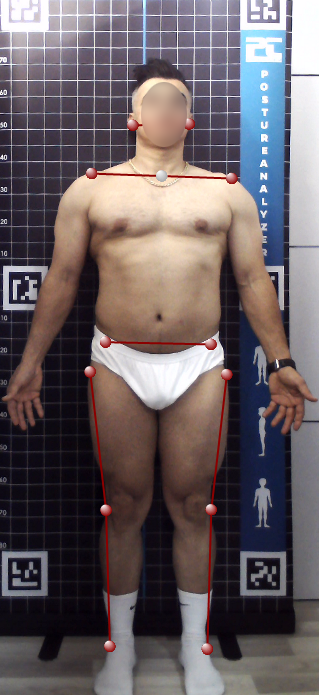
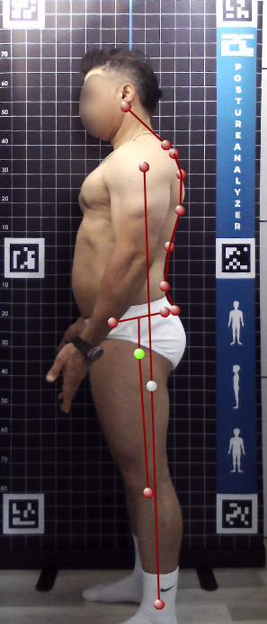
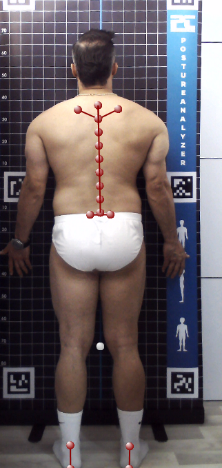

# AI-Assisted Posture Analysis System

### Body Landmark Detection

## Overview

This project focuses on the development of a computer vision-based posture analysis system designed for medical and rehabilitation applications.

The system detects body joints and skeletal landmarks without requiring physical markers, enabling non-invasive posture assessment and biomechanical analysis.

---

## Responsibilities

- Developed image processing pipelines
- Implemented body landmark detection workflows
- Integrated computer vision algorithms for posture assessment
- Improved image preprocessing and analysis procedures
- Participated in software design and testing

---

## Technologies

- Python
- OpenCV
- MediaPipe
- Rembg
- Image Processing
- Computer Vision

---

## Key Features

- Human body landmark detection
- Skeletal visualization
- Background removal
- Posture assessment workflows
- Image preprocessing

---

## Application Areas

- Rehabilitation
- Physical therapy
- Clinical posture assessment
- Biomechanical analysis

---

## Project Type

Industrial Medical Device Software Project

*Note: Source code is not publicly available due to intellectual property and company confidentiality policies.*
